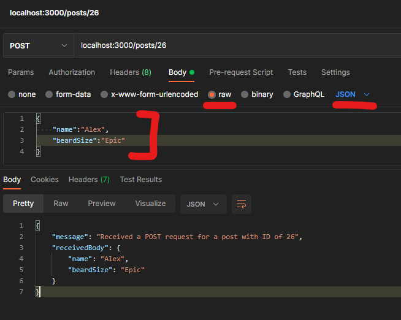
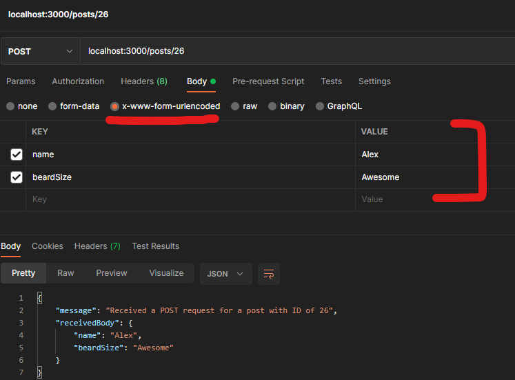

# expressjs-masterclass-demo
 Example of what the ExpressJS masterclass server for Flex1 2021 can look like.

## Hello World

Initialize your repo as an NPM project with this:

`npm init --y`

Note: "--y" will rush through with default settings, you can change them later if you need to though.

Install ExpressJS into a fresh project with this:

`npm install express --save`

Add this code to a `src/index.js` file:

```js
const express = require('express');
// Initialize Express as an instance named "app".
const app = express();

// Separate these out in case we wanna use Docker or something to wrap the app.
const PORT = 3000;
const HOST = '0.0.0.0';

// Best settings for setting up Express as an API server to receive and process JSON & form data.
app.use(express.json());
app.use(express.urlencoded({extended:true}));

// Standard ExpressJS route, sends back a HTML response
app.get('/', (request, response) => {

    response.send("Hello world!");
});

// API route, sends back a JSON response
app.get('/json',(request, response) => {

    response.json({'message':"Hello world!"})
});


// Run the server by making it 'listen' for network traffic
app.listen(PORT, HOST, () => {
    // Weird in-line conditional string interpolation to handle "0.0.0.0" -> "localhost" conversion
    console.log(`Hello world app listening at http://${HOST == "0.0.0.0" && "localhost"}:${PORT}/`);
});

```

Add this command to your `package.json` scripts section:

```
    "start":"node src/index.js"

```

Run your app with `npm start` and visit it on `localhost:3000` -- though if you changed the HOST or PORT values, use those values instead!

## Deploy to Heroku

Change your index.js code so that this line:

```js
const PORT = 3000;

```

Looks like this:

```js
const PORT = process.env.PORT || 3000;
```
Heroku will try to assign a random port number through an environment variable - we need that code to catch that port number.

Make sure your ExpressJS app works locally, and then commit your work to GitHub.

Go to: [https://dashboard.heroku.com/](https://dashboard.heroku.com/)

Make a new app.

In the app Deploy -> Deployment Method settings, choose "GitHub".

Automatic Deploys should be enabled after that - if not, enable it.

If no app is deployed immediately, you can either do a manual deploy (just below automatic deploys) or push a new commit to your repo.

Since the Heroku app is always updated whenever you push a new commit to your repo, your deployed app will reflect the latest version of your server.


## Routing

Create a `src/posts/postRoutes.js` file and put this code in it:

```js
const express = require('express');

// Create a bundle of routes. We'll export this out and then import it into src/index.js.
const routes = express.Router();

// This is the "root" route for the Router instance. 
// Its actual name in the URL will depend on how it's configured in src/index.js
routes.get('/', (request, response) => {

    response.json(`Received a request on ${request.originalUrl}`);
});

// Set up route params with the colon before the name.
routes.get('/:postID', (request, response) => {

    response.json(`Received a GET request for a post with ID of ${request.params.postID}`);

});

// Use Postman or another HTTP tool to visit a POST route.
routes.post('/:postID', (request, response) => {

    response.json(`Received a POST request for a post with ID of ${request.params.postID}`);
});

module.exports = routes;

```

In your `src/index.js` file, add these two lines of code somewhere before your `app.listen` statement:


```js

const importedPostRouting = require('./posts/postRoutes');
app.use('/posts', importedPostRouting);


```

Visit your new routes on your app URL `/posts`, such as `localhost:3000/posts` .


## Processing Data from POST Requests

Update your postRoutes file so the POST route that uses a param looks like this:

```js
// Use Postman or another HTTP tool to visit a POST route.
routes.post('/:postID', (request, response) => {
    // Cleanly build a response OBJ
    let jsonResponse = {
        message:`Received a POST request for a post with ID of ${request.params.postID}`,
        receivedBody: request.body
    }

    response.json(jsonResponse);
});

```

This part of our `src/index.js` that we wrote earlier is what will make this data posting work for us:

```js
// Best settings for setting up Express as an API server to receive and process JSON & form data.
app.use(express.json());
app.use(express.urlencoded({extended:true}));

```

We can submit JSON data, and we can submit "x-www-form-urlencoded" data. Either is fine, both work. Form URL Encoded might take precedence over JSON data, so try not to send both in a single call from your React app!

In Postman, you can make requests like this:

Raw JSON way:



Form Encoded way:




## Authentication

Using Firebase for auth as it has a nice (though potentially long-winded) way of setting of accounts, and supports a huge variety of options.

Go here and make a project (including any accounts you might need to make): [https://console.firebase.google.com/](https://console.firebase.google.com/)

Go to the Authentication page and select "Get started".

Choose "Email/Password" as your provider for now. Other ones can be set up at any time.

Note: The "Email link" option within "Email/Password" for passwordless sign-in is beyond the scope of this project, don't enable that for now.

Go to your "Project Setings" page -- find the "Project Overview" near the top left of the page and click on the gear icon next to it to find the link to "Project Settings".

On the "Project Settings -> General" section, there should be something about a "Default GCP resource location" having a value of "Not yet selected". Set that to whatever default value it suggests.

At the bottom of the page, there should be a "Your apps" section. Click on the icon that looks like this: `</>`

Give your app a name - this is internal to Firebase, no impact on anything you do that would be user-facing.

Don't enable Firebase Hosting - that's beyond the scope of this guide, and can be enabled later if you want to experiment with it later anyway.

Don't worry about any code or instructions provided after that -- that's for React apps, which doesn't help us in MERN. (The big idea with Firebase is that you can put back-end functionality into front-end apps, which isn't exactly secure and won't meet the requirements of the full-stack assessment either.)

Click through to get back to the "Project Settings" page. Click on the "Service Accounts" heading near the top-middle of the page.

The Firebase Admin SDK is what we need to do Firebase things in a back-end application. Install the Firebase Admin SDK into your project with this command: `npm install firebase-admin -- save`

While still on the "Project Settings -> Service Accounts" page, in the "Firebase Admin SDK" section, click on "Generate new private key". Save the file into a "keys" or other similarly-notable folder within your ExpressJS project. The file should be a JSON file with contents like this:

```json
{
  "type": "service_account",
  "project_id": "firebase project name",
  "private_key_id": "some key ID",
  "private_key": "some private key",
  "client_email": "some email",
  "client_id": "some ID",
  "auth_uri": "some URL",
  "token_uri": "some URL",
  "auth_provider_x509_cert_url": "some URL",
  "client_x509_cert_url": "some URL"
}


```
If it comes with or generates some file ending with "ZoneIdentifier" or similarly-garbled weirdness, delete that file.

Note: If you were to gitignore this key file, you must configure a way for that JSON string to be set as an environment variable so that it works in both local & Heroku environments. Bit of a hassle for a tutorial - we're just going blank out our key & delete the Firebase project when the repo becomes public.

Back in your ExpressJS app's `src/index.js` file, add this code before the routes begin:

```js
const firebaseAdmin = require('firebase-admin');
const serviceAccount = require('../keys/alexhexpressdemo-firebase-adminsdk-ihj1f-5a0a4272fb.json');
firebaseAdmin.initializeApp({
    credential: firebaseAdmin.credential.cert(serviceAccount),
});

```
Add this code to your `src/users/userRoutes.js` file:

```js
const express = require('express');

const routes = express.Router();

// Create a user, a session token & a refresh token
routes.post('/sign-up', async (request, response) => {
    // Process posted form/json data
    let newUserDetails = {
        email: request.body.email,
        password: request.body.password,
        displayName: request.body.username
    }
    // Ideally perform validation on those properties before moving on.

    // Hand data to a sign-up function

    // Return error or token as response

});

// Create a session token & refresh token
routes.post('/sign-in', async (request, response) => {
    // Process posted form/json data
    let newUserDetails = {
        email: request.body.email,
        password: request.body.password,
        displayName: request.body.username
    }
    // Ideally perform validation on those properties before moving on.

    // Hand data to a sign-in function

    // Return error or token as response

});

// Create a session token & refresh token
routes.post('/validate-session', async (request, response) => {
    // Process posted form/json data
    let newUserDetails = {
        idToken: request.body.idToken,
        refreshToken: request.body.refreshToken,
    }

    // Hand data to a validation function

    // Return error or token as response

});

module.exports = routes;

```

Go back to your Firebase "Project Settings" page, and down in the "Your apps" section select your current app.
Select the "Config" option -- you would've used the "npm" option so far.
The "Config" option represents the keys that a front-end app would use. The Firebase client library works in the back-end just fine, and will help us by providing additional user functionality alongside the Firebase Admin SDK. It's weird but basically the Admin SDK handles some things that the Client SDK doesn't, and vice versa.

Should be a JavaScript file like this:

```js
const firebaseClientConfig = {
  apiKey: "some key",
  authDomain: "some URL",
  projectId: "Firebase project ID",
  storageBucket: "some URL",
  messagingSenderId: "some ID",
  appId: "some Firebase app ID",
  measurementId: "some Google Analytics ID"
};

module.exports = {firebaseClientConfig}
```
Note that your Admin SDK key was a dedication JSON file, while this is a regular JavaScript file. Make sure it's clear which of your key files are for the Admin SDK and for the Client SDK.

Install the Firebase Client SDK with this command:

`npm install firebase`

Then, create a `src/users/userFunctions.js` file and give it these contents:


```js
// Firebase Admin SDK was initialized elsewhere, we just need access to its functions.
const firebaseAdmin = require('firebase-admin');

// Set up the Firebase Client SDK
const {firebaseClientConfig} = require('../../keys/clientConfigData');
const firebaseClient = require("firebase/app");
// Add the Firebase products that you want to use
const {getAuth, signInWithEmailAndPassword} = require ("firebase/auth");
// Initialize the Firebase Client SDK
firebaseClient.initializeApp(firebaseClientConfig);

async function signUpUser(userDetails){
    // Use the Firebase Admin SDK to create the user
    return firebaseAdmin.auth().createUser({
        email: userDetails.email, // User email address.
        emailVerified: true, // Required for fuller user functionality, but a hassle to set up in a short tutorial. Set to false if you do end up configuring email verifications, as the email system will set it to true.
        password: userDetails.password, // password. You'll never see this value even as project admin.
        displayName: userDetails.displayName, // the username
        // photoURL: "", // point to an image file hosted elsewhere
        disabled: false // if a user is banned/usable
    }).then( async (userRecord) => {
        console.log(`\n Raw userRecord is ${JSON.stringify(userRecord)} \n`);
        
        // Set "Custom Claims" on the new user
        let defaultUserClaims = firebaseAdmin.auth().setCustomUserClaims(userRecord.uid, {regularUser: true}).then(() => {
            console.log("Set a regularUser claim to the new user! They must log in again to get the new access.");
            // You can do things like detect values in the email address (eg. if the new user email is the project admin email) and set the claim object to include other values.
            // Claims allow you to handle authorization without ever giving the client any data that they could hack or manipulate.
            // Of course, you can still pass the claims along to the client if you want to (eg. for front-end authorization to hide content), just know that front-end authorization isn't bulletproof.

        });

        return userRecord;
        
    }).catch(error => {
        console.log("Internal sign-up function error is: \n" + error);
        return {error:error};
    });
}

async function signInUser(userDetails){
    const firebaseClientAuth = getAuth();

    let signInResult = signInWithEmailAndPassword(firebaseClientAuth, userDetails.email, userDetails.password)
    .then(async (userCredential) => {

        let userIdToken = await firebaseClientAuth.currentUser.getIdTokenResult(false);

        console.log(`userIdToken obj is\n ${JSON.stringify(userIdToken)}`);

        return {
            idToken: userIdToken.token,
            refreshToken: userCredential.user.refreshToken,
            email: userCredential.user.email,
            emailVerified: userCredential.user.emailVerified,
            displayName: userCredential.user.displayName,
            photoURL: userCredential.user.photoURL,
            uid: userCredential.user.uid
        }
    }).catch(error => {
        console.log("Internal signin function error is: \n" + error);
        return {error:error};
    });

    return signInResult;
}

async function validateUserSession(sessionDetails){
    let userRefreshToken = sessionDetails.refreshToken;
    let userIdToken = sessionDetails.idToken;

    return firebaseAdmin.auth().verifyIdToken(userIdToken, true).then(async (decodedToken) => {

        console.log(`Decoded session token is ${JSON.stringify(decodedToken)}`);

        return {
            isValid: true,
            uid: decodedToken.uid,
            fullDecodedToken: decodedToken
        }
    }).catch((error) => {
        if (error.code == 'auth/id-token-revoked') {
            // Token has been revoked. Inform the user to reauthenticate or signOut() the user.
            console.log("You must sign in again to access this. Full error is: \n" + error);
        } else {
            // Token is invalid.
            console.log("Session token is invalid. Full error is: \n" + error);
        }
          
        return {error:error};
    });
}


module.exports = {
    signUpUser, signInUser, validateUserSession
}

```


Then, go back to your `src/users/userRoutes.js` and update each route to use the new functions:


```js
const express = require('express');

const routes = express.Router();

const {signUpUser, signInUser, validateUserSession} = require ('./userFunctions');

// Create a user, a session token & a refresh token
routes.post('/sign-up', async (request, response) => {
    // Process posted form/json data
    let newUserDetails = {
        email: request.body.email,
        password: request.body.password,
        displayName: request.body.username
    }
    // Ideally perform validation on those properties before moving on.

    // Hand data to a sign-up function
    let signUpResult = await signUpUser({email:newUserDetails.email, password:newUserDetails.password});
    // Return error or token as response
    if (signUpResult.error != null){
        console.log("Stopping the signup process due to an error. See logs for details.");
        response.json(signUpResult);
        return;
    }

    // Sign in to get latest user claims (authorization).
    let signInResult = await signInUser({email:newUserDetails.email, password:newUserDetails.password});
    
    // If an error message exists, return that.
    if (signInResult.error != null){
        console.log("Stopping the signup process due to an error. See logs for details.");
        response.json(signInResult);
        return;
    }

    // On success, return a signed-in session to the brand-new user:
    response.json(signInResult);

});

// Create a session token & refresh token
routes.post('/sign-in', async (request, response) => {
    // Process posted form/json data
    let userDetails = {
        email: request.body.email,
        password: request.body.password,
        displayName: request.body.username
    }
    // Ideally perform validation on those properties before moving on.

    // Hand data to a sign-in function
    let signInResult = await signInUser({email:userDetails.email, password:userDetails.password});
    
    // If an error message exists, return that.
    if (signInResult.error != null){
        console.log("Stopping the signup process due to an error. See logs for details.");
        response.json(signInResult);
        return;
    }

    // On success, return a signed-in session to the brand-new user:
    response.json(signInResult);
});

// Create a session token & refresh token
routes.post('/validate-session', async (request, response) => {
    // Process posted form/json data
    let sessionDetails = {
        idToken: request.body.idToken,
        refreshToken: request.body.refreshToken,
    }

    // Hand data to a validation function
    let validationResult = await validateUserSession({refreshToken: sessionDetails.refreshToken, idToken:sessionDetails.idToken})
    
    // Return error or token as response
    response.json(validationResult);

});

module.exports = routes;


```

Commit and push your work again to see how things work on the live deployed app. Remember to use Postman to test out non-GET routes!


## MongoDB

TODO!


## ExpressJS as Micro-Services

Everything that you split out into a separate instance of `express.Router()` can be its own server!
More info coming soon, maybe.